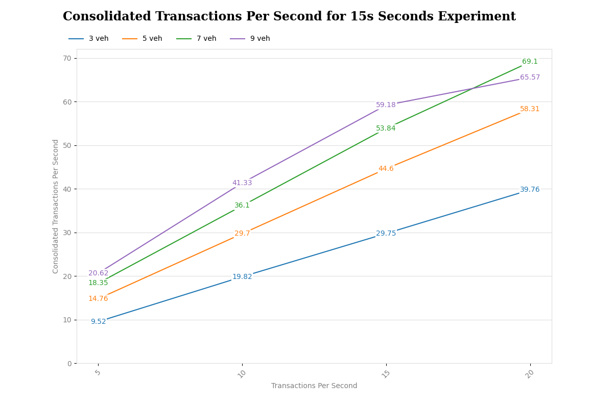
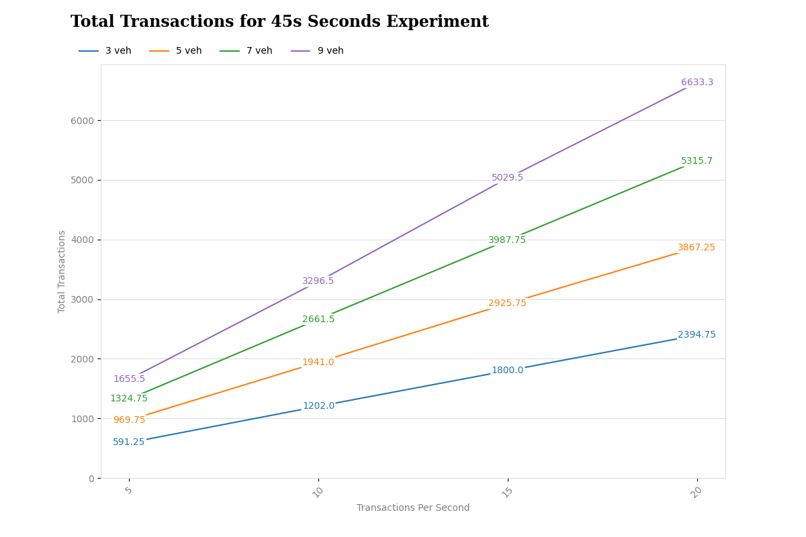
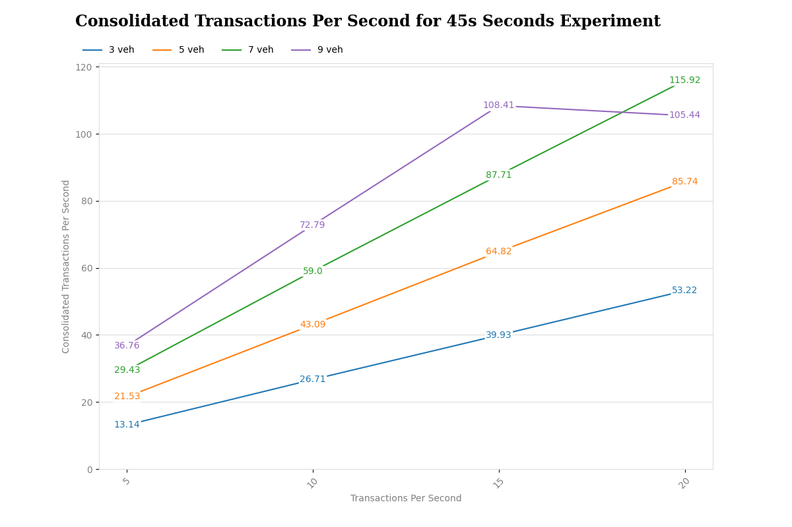
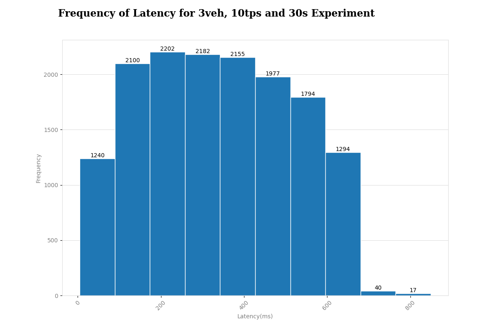

# Experimenting BEDR with Hyperledger Iroha

    

A crucial question regarding BEDR's feasibility is the difficulty in dealing with vehicles groups of dynamic sizes and duration.
Aiming to study these aspects, we perform the following experiment in two stages.
The first stage simulates the behavior of vehicles moving on a realistic map, implementing a VANET.
We utilize an urban mobility generator and a network simulator for composing this task.
The simulated vehicles perform a clustering algorithm with few modifications to control groups' endurance and size.
This step produces log files describing clustering events and vehicle transactions.
The experiment's second stage uses the generated log files as input, reading data and transforming it into timelines.
These timelines enable replay events in simulation time, dispatching them as transactions to a Hyperledger Iroha blockchain implementation.
We chose Hyperledger Iroha for its simplicity and unique design for working with IoT applications.
Iroha infrastructure run on containers, replicating the vehicles simulated in the first step.
By doing that, we can evaluate how Iroha would perform in different setups, more precisely with vehicles groups of varying sizes and duration.

## First Stage

The first stage adopts Eclipse MOSAIC as a VANET simulator.
In turn, MOSAIC uses Simulation of Urban MObility (SUMO) to generate the mobility of nodes on a map of the Ipanema's neighborhood in Rio de Janeiro, Brazil.
MOSAIC Simple Network Simulator (SNS) performs the network simulation.
These simulators and the mentioned urban area are the same tools used in the clustering experiment in Vieira et al.

We control the vehicle's flow to induce the formation of groups of a specific size range.
The simulation starts by inserting the vehicles into the map.
After an initial clustering phase, vehicles submit transactions to the blockchain.
MOSAIC records each change in the group configuration (i.e., peers addition and removal) and the vehicle transactions.
It produces a log file that assigns a timestamp offset relative to the simulation start.
When the simulation finishes, each vehicle has its respective log file.

## Second Stage

The second stage reproduces all the vehicles' mobility simulation events in a Hyperledger Iroha blockchain.
We created two Python modules called Dispatcher and Broker. 
The Dispatcher reads, interprets, and recreates the vehicles' timeline.
In turn, the Broker builds and manages subprocesses with queues for each vehicle in the simulation.
We use Python's ``sched'' module to schedule timeline events in real-time simulation.

The stage starts with the Dispatcher adding each event to the corresponding vehicle subprocess queue.
Inside the Broker, each vehicle subprocess handles its respective events by calling an Application Programming Interface (API) method designed to forward blockchain implementations.
The Docker tool (www.docker.com) was chosen to create and manage simulated vehicles' containers.
At the same time, each vehicle possesses a client account on the blockchain.
When the Broker executes an event, the respective client submits a transaction to the blockchain.
The blockchain treats the vehicle's sensors state as the client's account details in Iroha.
We use commands like ``setAccountDetail'' to record state changes in the ledger.

## Parameters and metrics

The described experiment develops different scenarios to evaluate the performance of Iroha (i.e., the chosen blockchain platform).
The group size, duration, the blockchain consensus  (generated blocks), and throughput (in transactions per second or TPS) serve as evaluation parameters.
We fix the workload (i.e., amount of transactions from each vehicle) in each run to avoid results variation due to different variances in the vehicle's sensor states.

We define group size and duration parameters from our previous findings in Vieira et al., which simulates clustering in VANETs and points out that most vehicle groups have less than ten members and dies before 60 seconds.
Thus we fix our group sizes in 3, 5, 7, and 9 vehicles, and group duration within 15, 30, and 45 seconds.
Simulation time includes the group formation by clustering algorithm and transactions submission.

The workload (i.e., number of submitted transactions) for each vehicle changes with 5, 10, 15, and 20 TPS.
We defined these workload rates by exploring Iroha's theoretical performance limit through the following test.
We run our experiment simulating three and nine (i.e., min and max) vehicles and increasing the workload rate until Iroha loses transactions.
Within a threshold of 10\% of transaction loss, the workload rises until 61 TPS per vehicle (total workload of 183 TPS) and 16 TPS (total workload of 144 TPS) within 3 and 9 vehicles, respectively.
Assuming the Iroha's limit is around 180 TPS, we fix 20 TPS as the max workload per vehicle in a simulation with nine vehicles.

In each experiment scenario, we evaluate five metrics: a) workload (i.e., submitted transactions), b) the number of consolidated blocks, c) the number of consolidated transactions, d) the number of in-queue transactions (i.e., transactions waiting for Dispatcher/Broker), and e) the number of Iroha's pending transaction (i.e., lost transactions).
The number of consolidated blocks and transactions comes from the ledger of each vehicle.

## Results and discussion

The experiment runs on an Intel Xeon E-2146 3.50Ghz server (mono processor with six cores and 12 threads).
The hardware has a Gigabyte® server motherboard C246M-WU4 with 128 GB of DDR4-3200 UDIMM RAM and a PNY CS900 SSD disk.

The following Figure summarizes the experiment in all the proposed scenarios, with the vehicles group duration of 30 seconds.
We repeat 20 times each scenario simulation.
The X-axis shows the variation of TPS per vehicle in the four distinct vehicle group sizes (i.e., 3, 5, 7, and 9).
The Y-axis displays the transaction count.
The stacked bars exhibit in three colors the transaction status: consolidated, vehicle queued, and Iroha pending.
In groups with 3 and 5 vehicles, the blockchain consolidates almost 100% of the transactions.
We only observe lost transactions in simulations with 7 and 9 vehicles when submitting a workload greater than 20 and 15 TPS, respectively.
This transaction amount is close to the same values found as Iroha's performance theoretical limits.

    

The following Figure shows the evolution of the number of blocks consolidated in the 30-second experiment.
The X-axis shows the workload growing in TPS.
The Y-axis represents the mean of blocks generated in the 20 repetitions of each scenario.
The lines display the blockchain throughput for each vehicle groups' size.
The greater the group size, the fewer the throughput due to the required supermajority (> 2/3) of votes from the YAC consensus.
However, experiments with more vehicles consolidate more transactions, indicating more transactions per block in the ledger.

    

Our experiment concludes that the BEDR proposal is functional for implementing distributed EDR solutions.
The performance benchmark brings information regarding the adoption of the Hyperledger Iroha platform.
One can notice that, despite the simulated VANET scenarios with different group sizes, Iroha presented an acceptable performance, close to the same expected in a conventional scenario where peers are fixed nodes.
Furthermore, it is possible to implement the BEDR concept in other permissioned blockchain platforms.
We emphasize that different consensus protocols can perform still better in dynamic scenarios such as VANETs.
We glimpse these topics as future works in our research.

Encouraging drivers to join is also one of the challenges regarding BEDR.
However, we see rewards for the block's proponents as a strategy for incentivizing it.
The Iroha performs a node permutation on each round of new blocks proposal.
Peers voting on YAC consensus also evaluate each new block before accepting and adding it to the ledger.
Thus, implementing credit rewards for the block's proponents in each round can constitute an incentivizing mechanism.
A vehicle can propose several blocks during its journey.
It also could exchange the received credits for digital or fiat currency upon presentation of the ledger.
At this moment, the vehicle "delivers" its chains in exchange for the reward prize indicated in its chain blocks.
The more vehicles sell the same information, the higher the trust in data.

## Complementary Results
The experiments generated datasets in xlsx files, which can be consulted in [Spreadsheets](./fourth_stage/output/spreadsheets/)
The datasets represent the results of the 15, 30, and 45 second experiments.
We use the parameters of 3, 5, 7, and 9 vehicles and 5, 10, 15, and 20 transactions per second.

### Line Charts
We build line charts by summarizing data like:
* Consolidated transactions
* Percentage of consolidated transactions
* Consolidated transactions per second
* Total transactions generated by the experiment
* Total blocks consolidated

In these graphs, the X-axis represents the workload in tps while the Y-axis shows the information listed above.

|                          Lines Charts 15-Seconds Experiment                          |                                                               |
|:------------------------------------------------------------------------------------:|:-----------------------------------------------------------------------------------:|
|                   |                             |
|            |  |
|  |                                                                                     |

 

|                          Lines Charts 30-Seconds Experiment                          |                                                               |
|:------------------------------------------------------------------------------------:|:-----------------------------------------------------------------------------------:|
|                   |                             |
|            |  |
|  |                                                                                     |

 

|                          Lines Charts 45-Seconds Experiment                          |                                                               |
|:------------------------------------------------------------------------------------:|:-----------------------------------------------------------------------------------:|
|                   |                             |
|            |  |
|  |                                                                                     |

 

### Stacked Bar Charts
Usando stacked bars chart analisamos os status das transações ao final do experimento, enfatizando as transações consolidadas, enfileiradas no Dispatcher e pendentes no Hyperledger Iroha.
A altura total da barra representa o total de transações geradas.
Cada um dos gráficos apresenta o workload no X-axis em tps e a contagem de transações no Y-axis.
As cores das barras empilhadas apresentam o status da transação. 
No topo de cada barra é apresentado o total de transações representadas.

Using stacked bars chart, we analyzed transaction status at the end of the experiment, emphasizing consolidated transactions, queued in Dispatcher and pending in Hyperledger Iroha.
The net height of the bar represents the total number of transactions generated.
Each of the graphs shows in X-axis the workload in tps and the Y-axis transaction count.
The colors of the stacked bars show the status of the transaction at the end of the experiment.
At the top of each bar, the total number of transactions represented is displayed.

|                  Stacked Bar Charts 15-Seconds Experiment                   |                                                                             |
|:---------------------------------------------------------------------------:|:---------------------------------------------------------------------------:|
|  |  |
|  |  |

 

|                  Stacked Bar Charts 30-Seconds Experiment                   |                                                                             |
|:---------------------------------------------------------------------------:|:---------------------------------------------------------------------------:|
|  |  |
|  |  |

 

|                  Stacked Bar Charts 45-Seconds Experiment                   |                                                                             |
|:---------------------------------------------------------------------------:|:---------------------------------------------------------------------------:|
|  |  |
|  |  |

 

### Histograms
We account for the latency of all transactions committed by the experiment by subtracting the timestamp from the time of block creation
from the time of submission of the transaction.
We present this information in frequency histogram format.
The X-axis displays latencies in milliseconds, while the Y-axis represents the frequency of occurrence of values.
We use ten bins per chart.
The following tables presents the number of vehicles in its rows and the workload in tps in the columns for the different experiments executed.

<table>
    <td colspan="5">Latency Histogram 15-seconds Experiment</td>
    <tr>
        <td></td>
        <th>5 TPS</th>
        <th>10 TPS</th>
        <th>15 TPS</th>
        <th>20 TPS</th>
    </tr>
    <tr>
        <th>3 Vehicle</th>
        <td></td>
        <td></td>
        <td></td>
        <td></td>
    </tr>
    <tr>
        <th>5 Vehicle</th>
        <td></td>
        <td></td>
        <td></td>
        <td></td>
    </tr>
    <tr>
        <th>7 Vehicle</th>
        <td></td>
        <td></td>
        <td></td>
        <td></td>
    </tr>
    <tr>
        <th>9 Vehicle</th>
        <td></td>
        <td></td>
        <td></td>
        <td></td>
    </tr>
</table>

 

<table>
    <td colspan="5">Latency Histogram 30-seconds Experiment</td>
    <tr>
        <td></td>
        <th>5 TPS</th>
        <th>10 TPS</th>
        <th>15 TPS</th>
        <th>20 TPS</th>
    </tr>
    <tr>
        <th>3 Vehicle</th>
        <td></td>
        <td></td>
        <td></td>
        <td></td>
    </tr>
    <tr>
        <th>5 Vehicle</th>
        <td></td>
        <td></td>
        <td></td>
        <td></td>
    </tr>
    <tr>
        <th>7 Vehicle</th>
        <td></td>
        <td></td>
        <td></td>
        <td></td>
    </tr>
    <tr>
        <th>9 Vehicle</th>
        <td></td>
        <td></td>
        <td></td>
        <td></td>
    </tr>
</table>

 

<table>
    <td colspan="5">Latency Histogram 45-seconds Experiment</td>
    <tr>
        <td></td>
        <th>5 TPS</th>
        <th>10 TPS</th>
        <th>15 TPS</th>
        <th>20 TPS</th>
    </tr>
    <tr>
        <th>3 Vehicle</th>
        <td></td>
        <td></td>
        <td></td>
        <td></td>
    </tr>
    <tr>
        <th>5 Vehicle</th>
        <td></td>
        <td></td>
        <td></td>
        <td></td>
    </tr>
    <tr>
        <th>7 Vehicle</th>
        <td></td>
        <td></td>
        <td></td>
        <td></td>
    </tr>
    <tr>
        <th>9 Vehicle</th>
        <td></td>
        <td></td>
        <td></td>
        <td></td>
    </tr>
</table>

